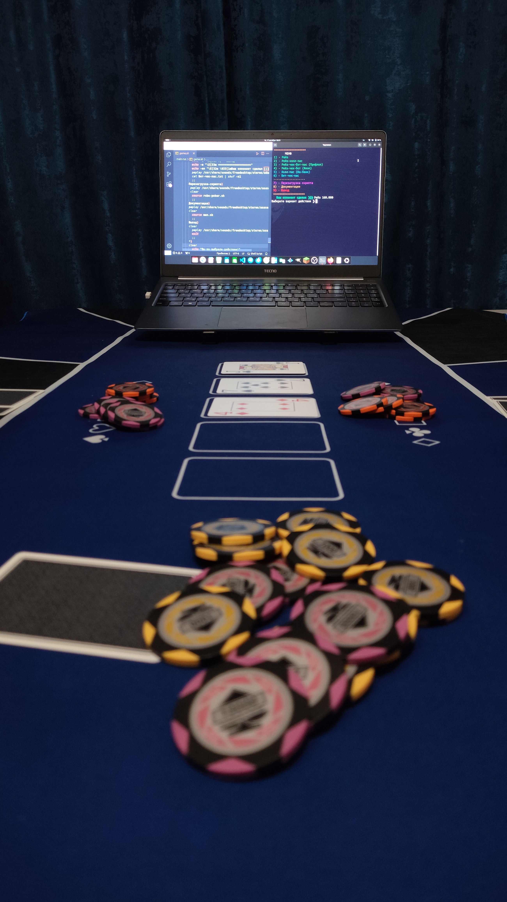

<p align="center"></p>

# RoboPoker
Рандомно-последовательный скрипт для выбора "опций" в покере (Техасский холдем).
Скрипт берёт рандомное действие либо число из базы данных и выводит его на экран.
Таким образом, вы сможете играть в покер, один дома. 

Смотрите документацию по скрипту: [WIKI](https://github.com/Kisonix-Dev/RoboPoker/wiki/%D0%9D%D0%B0%D1%87%D0%B0%D0%BB%D0%BE)

## Демонстрация скрипта
<p align="center"></p>
<p align="center"></p>

#### Видео демонстрация: [Скоро](#)

## Перед запуском
Для корректной работы скрипта, вам необходимо скопировать 2 аудиофайла. 
<p>ИЗ каталога: /robo-poker/audio</p>
<p>В каталог: /usr/share/sounds/freedesktop/stereo</p>
А так-же установить пакет: pulseaudio-utils.
Скопировать аудиофайлы можно при помощи пакета: Midnight commander.
Скрипт был проверен только в дистре: Ubuntu. (Не кидайтесь тапками).

### Пакеты
1. Midnight commander.
```
sudo apt-get install mc
```
2. PulseAudio Utils.
```
sudo apt-get install pulseaudio-utils
```
3. Обновить все пакеты.
```
sudo apt-get update & upgrade
```
4. Запуск скрипта. (Главный файл скрипта: robo-poker.sh)

## ENG 
Random-sequential script for choosing "options" in poker (Texas Hold'em). 
The script takes a random action or number from the database and displays it on the screen. 
So you can play poker, alone at home.

See the script documentation: [WIKI](https://github.com/Kisonix-Dev/RoboPoker/wiki/Start)

## Before launch
For the script to work correctly, you need to copy 2 audio files.
<p>FROM the catalog: /robo-poker/audio</p>
<p>TO the catalog: /usr/share/sounds/freedesktop/stereo</p>
And also install the package: pulseaudio-utils.
You can copy audio files using the package: Midnight commander.
The script was tested only in the distro: Ubuntu. (Don't throw slippers).

### Packages
1. Midnight commander.
```
sudo apt-get install mc
```
2. PulseAudio Utils.
```
sudo apt-get install pulseaudio-utils
```
3. Update all packages.
```
sudo apt-get update & upgrade
```
4. Launching the script. (Main script file: robo-poker.sh)