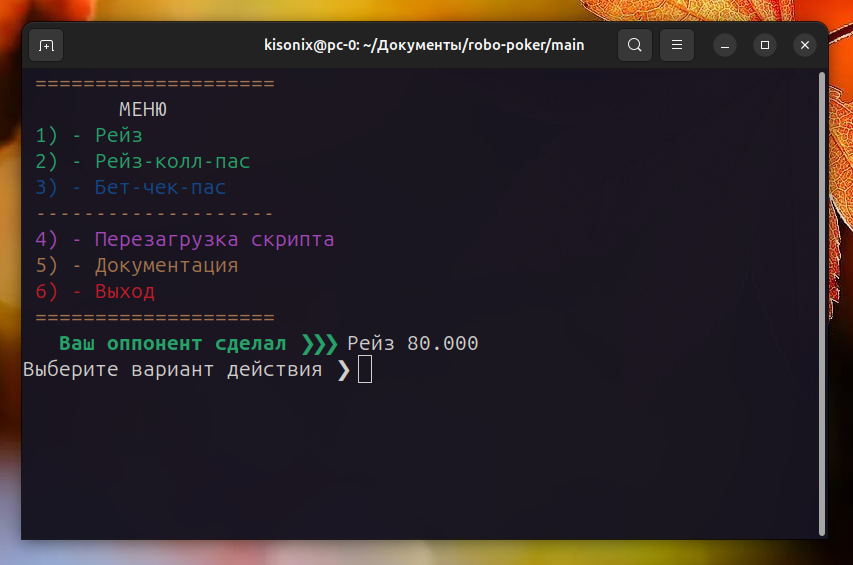

<p align="center"></p>

# RoboPoker
Рандомно-последовательный скрипт для выбора "опций" в покере (Техасский холдем).
Скрипт берёт рандомное действие либо число из базы данных и выводит его на экран.
Таким образом, вы сможете играть в покер, один дома. 

Данный скрипт будет доступен как на Русском языке, так и на Английском языке.


## Важно!
Для коректной работы скрипта, вам необходимо скопировать 2 аудиофайла. 
ИЗ каталога: /robo-poker/audio
В каталог: /usr/share/sounds/freedesktop/stereo/adadad.mp3
А так-же установить пакет: pulseaudio-utils.
Скопировать аудиофайлы можно при помощи пакета: Midnight commander.
Скрипт был проверен только в дистре: Ubuntu. (Не кидайтесь тапками).

### Пакеты
1. Midnight commander install.
```
sudo apt-get install mc
```
2. PulseAudio install.
```
sudo apt-get install pulseaudio-utils
```
3. Обновить все пакеты.
```
sudo apt-get update & upgrade
```

<p align="center"></p>

## ENG 
Random-sequential script for choosing "options" in poker (Texas Hold'em). 
The script takes a random action or number from the database and displays it on the screen. 
So you can play poker, alone at home.

This script will be available in Russian and English.