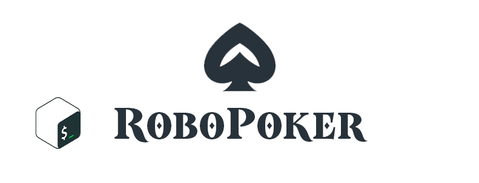

<p align="center"></p>

# RoboPoker

Рандомно-последовательный скрипт для выбора "опций" в покере (Техасский холдем).
Скрипт берёт рандомное действие либо число из базы данных и выводит его на экран.
Таким образом, вы сможете играть в покер, один дома.

Документация: [WIKI](https://github.com/Kisonix-Dev/RoboPoker/wiki/%D0%9D%D0%B0%D1%87%D0%B0%D0%BB%D0%BE)

## Демонстрация скрипта

<p align="center"></p>
<p align="center"></p>

## Перед запуском

<p>Для корректной работы скрипта, вам необходимо установить Зависимости!</p>
<p>Скрипт был собран в deb пакет (Не кидайтесь пингвинами).</p>
<p>Для ОС Windows, можете использовать отдельную версию программы! (СКОРО). Либо WSL.</p>
<P>Вам больше не требуется устанавливать скрипт вручную и перекидывать аудио! Используйте команду в терминале:</P>

```
sudo dpkg -i RoboPoker-rus.deb
```
<p>Скрипт установится в вашей системе как программа и в меню появится ярлык для запуска скрипта.</p>
<p>Чтобы удалить скрипт, воспользуйтесь командой в терминале:</p> 

```
sudo apt-get remove robopoker
```

### Зависимости

1. PulseAudio Utils.

```
sudo apt-get install pulseaudio-utils
```

2. Обновить все пакеты.

```
sudo apt-get update & upgrade
```

## ENG

Random-sequential script for choosing "options" in poker (Texas Hold'em).
The script takes a random action or number from the database and displays it on the screen.
So you can play poker, alone at home.

Documentation: [WIKI](https://github.com/Kisonix-Dev/RoboPoker/wiki/Start)

## Before launch

<p>For the script to work correctly, you need to install Dependencies!</p>
<p>The script was compiled into a deb package (Don't throw penguins).</p>
<p>For Windows OS, you can use a separate version of the program! (COMING SOON). Or WSL.</p>
<p>You no longer need to install the script manually and transfer audio! Use the command in the terminal:</p>

```
sudo dpkg -i RoboPoker-eng.deb
```
<p>The script will be installed on your system as a program and a shortcut to run the script will appear in the menu.</p>
<p>To remove the script, use the command in the terminal:</p> 

```
sudo apt-get remove robopoker
```

### Dependencies

1. PulseAudio Utils.

```
sudo apt-get install pulseaudio-utils
```

2. Update all packages.

```
sudo apt-get update & upgrade
```
